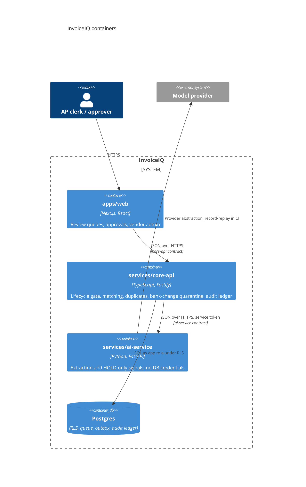

# C4 level 2: containers

| Container | Can move money? | Holds DB credentials? |
| --- | --- | --- |
| apps/web | No (asks core-api) | No |
| core-api | Yes, through the lifecycle gate only | Yes (app role, RLS) |
| ai-service | No | No |
