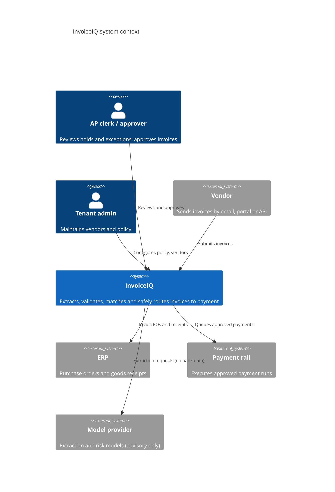

# C4 level 1: system context

```mermaid
C4Context
  title InvoiceIQ system context
  Person(clerk, "AP clerk / approver", "Reviews holds and exceptions, approves invoices")
  Person(admin, "Tenant admin", "Maintains vendors and policy")
  System_Ext(vendor, "Vendor", "Sends invoices by email, portal or API")
  System(invoiceiq, "InvoiceIQ", "Extracts, validates, matches and safely routes invoices to payment")
  System_Ext(erp, "ERP", "Purchase orders and goods receipts")
  System_Ext(bank, "Payment rail", "Executes approved payment runs")
  System_Ext(llm, "Model provider", "Extraction and risk models (advisory only)")

  Rel(vendor, invoiceiq, "Submits invoices")
  Rel(clerk, invoiceiq, "Reviews and approves")
  Rel(admin, invoiceiq, "Configures policy, vendors")
  Rel(invoiceiq, erp, "Reads POs and receipts")
  Rel(invoiceiq, bank, "Queues approved payments")
  Rel(invoiceiq, llm, "Extraction requests (no bank data)")
```

The model provider sits outside the payment path: nothing it returns can move
an invoice anywhere except HOLD (ADR-0007).
